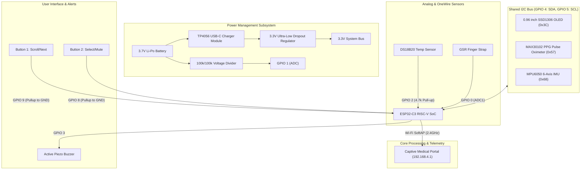

# Circuit Diagram & Hardware Interconnections

**Project:** Smart Health Monitor Band (ESP32-C3)  
**Competition:** Kerala State Sasthrolsavam / Sasthramela (Electronics)  

---

## 1. Pin Mapping Table (ESP32-C3 SuperMini / NodeMCU)

| Module / Sensor | Sensor Pin | ESP32-C3 Pin | Interface / Type | Notes |
| :--- | :--- | :--- | :--- | :--- |
| **0.96" OLED Display** | VCC | 3.3V | Power | SSD1306 128x64 Monochrome I2C |
| | GND | GND | Ground | |
| | SCL | GPIO 5 | I2C Clock | Hardware I2C bus (Shared) |
| | SDA | GPIO 4 | I2C Data | Hardware I2C bus (Shared) |
| **MAX30102 PPG** | VIN | 3.3V | Power | Heart Rate & SpO2 Sensor |
| | GND | GND | Ground | |
| | SCL | GPIO 5 | I2C Clock | Shared I2C Bus |
| | SDA | GPIO 4 | I2C Data | Shared I2C Bus |
| | INT | GPIO 6 (Opt) | Digital Input | Optional hardware interrupt |
| **MPU6050 6-Axis IMU** | VCC | 3.3V / 5V | Power | Accelerometer & Gyroscope |
| | GND | GND | Ground | |
| | SCL | GPIO 5 | I2C Clock | Shared I2C Bus (Address 0x68) |
| | SDA | GPIO 4 | I2C Data | Shared I2C Bus |
| **DS18B20 Temp** | VDD | 3.3V | Power | Digital Body Temperature |
| | GND | GND | Ground | |
| | DQ (Data) | GPIO 2 | OneWire Bus | Needs 4.7kΩ Pull-up Resistor to 3.3V |
| **GSR Strap Sensor** | VCC | 3.3V | Power | Galvanic Skin Response (Stress) |
| | GND | GND | Ground | Connected via finger straps |
| | SIG (Analog) | GPIO 0 | ADC1_CH0 | 12-bit Analog Input |
| **Active Buzzer** | Positive (+) | GPIO 3 | Digital Output | High-frequency alert buzzer |
| | Negative (-) | GND | Ground | Driven directly / via NPN transistor |
| **Button 1 (Scroll)** | Terminal A | GPIO 9 | Digital Input | Internal Pullup (Pressed = LOW) |
| | Terminal B | GND | Ground | Next screen navigation |
| **Button 2 (Select)** | Terminal A | GPIO 8 | Digital Input | Internal Pullup (Pressed = LOW) |
| | Terminal B | GND | Ground | Acknowledge alert / Mute buzzer |
| **Battery Monitor** | Divider Out | GPIO 1 | ADC1_CH1 | 100kΩ / 100kΩ voltage divider from LiPo |
| **TP4056 Charger** | BAT+ | Li-Po 3.7V (+) | Power Supply | 3.7V 500mAh-1000mAh LiPo Battery |
| | BAT- | Li-Po 3.7V (-) | Ground | |
| | OUT+ | ME6211 / 3.3V | Regulator Input | Converts LiPo 3.7V-4.2V to 3.3V |
| | OUT- | GND | System Ground | |

---

## 2. Schematic Flow Diagram

---

## 3. Physical Layout & Assembly Details
1. **Wearable Form Factor**:
   - The 0.96" OLED is mounted flush on the top casing.
   - **Tactile Push Buttons** are mounted directly below the OLED screen (Left: `SCROLL`, Right: `SELECT`).
   - The **MAX30102 optical PPG sensor** and **DS18B20 temperature probe** sit on the bottom wrist contact pad.
   - The **GSR finger straps** connect via a flexible 2-pin quick-release connector to the index and middle fingers.
2. **Noise Isolation**:
   - 100nF decoupling ceramic capacitors placed across VCC-GND of MAX30102 and MPU6050 to prevent noise during Wi-Fi transmission bursts.
