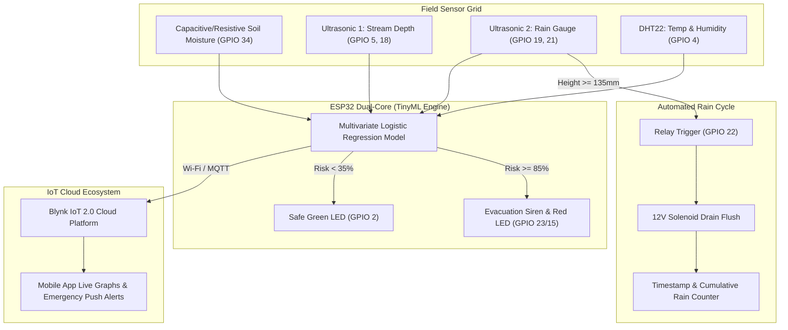

# Circuit Diagram & Hardware Interconnections

**Project:** AIoT Landslide & Flash Flood Early Warning System (ESP32)  
**Competition:** Kerala State Sasthrolsavam / Sasthramela (IoT Category)  

---

## 1. Pin Mapping Table (ESP32 38-Pin / 30-Pin DevKit)

| Sensor / Actuator | Module Pin | ESP32 Pin | Interface / Type | Notes |
| :--- | :--- | :--- | :--- | :--- |
| **Soil Moisture Sensor** | Analog Out (A0) | GPIO 34 | ADC1_CH6 (Input) | Calibrated for 0-100% Volumetric Water Content |
| | VCC | 3.3V | Power | Power via 3.3V to minimize electrode corrosion |
| | GND | GND | Ground | Common Ground |
| **Ultrasonic 1 (Stream Level)** | TRIG | GPIO 5 | Digital Output | 10µs trigger pulse |
| | ECHO | GPIO 18 | Digital Input | Voltage divider (1kΩ/2kΩ) used to step down 5V echo to 3.3V |
| | VCC | 5V (VIN) | Power | 5V Power Supply |
| | GND | GND | Ground | Common Ground |
| **Ultrasonic 2 (Rain Gauge)** | TRIG | GPIO 19 | Digital Output | Measures rain chamber water column |
| | ECHO | GPIO 21 | Digital Input | Stepped down with 1kΩ/2kΩ divider |
| | VCC | 5V (VIN) | Power | 5V Power Supply |
| | GND | GND | Ground | Common Ground |
| **12V Solenoid Valve Relay** | IN (Signal) | GPIO 22 | Digital Output | Active HIGH Relay Trigger |
| | VCC | 5V | Power | Relay module power |
| | GND | GND | Ground | Common Ground |
| | Relay COM / NO | External 12V | High-Current DC | 12V 1A DC Adapter to 12V NC/NO Solenoid |
| **DHT22 Sensor** | Data | GPIO 4 | Digital One-Wire | 4.7kΩ / 10kΩ Pull-up Resistor to 3.3V |
| | VCC | 3.3V / 5V | Power | Temperature & Relative Humidity |
| | GND | GND | Ground | Common Ground |
| **Active Alert Siren** | Positive (+) | GPIO 23 | Digital Output | High-Decibel Evacuation Buzzer |
| | Negative (-) | GND | Ground | Driven via 2N2222 NPN Transistor |
| **Status LED: Safe (Green)** | Anode (+) | GPIO 2 | Digital Output | In series with 220Ω Resistor |
| **Status LED: Alert (Red)** | Anode (+) | GPIO 15 | Digital Output | In series with 220Ω Resistor |

---

## 2. Rain Gauge Siphoning Chamber Design

```
            [Funnel Top (Catchment Area: 100cm²)]
                           \     /
                            \   /
                             | |
           +-----------------+ +-----------------+
           | [Ultrasonic Sensor 2 (HC-SR04)]     |  <-- GPIO 19 / 21
           |   (Emits ultrasonic pulse to water) |
           |                  |                  |
           |                  v                  |
           | ~ ~ ~ ~ ~ ~ ~ ~ ~ ~ ~ ~ ~ ~ ~ ~ ~ ~ |  <-- Water Level: 135mm (Threshold)
           |                                     |
           |       [Rain Collection Bottle]      |
           |                                     |
           |                                     |
           +------------------+------------------+
                              |
                     [12V Solenoid Valve]          <-- GPIO 22 (Relay Trigger)
                              |
                         (Drain Flush)
```

---

## 3. Sensor Fusion & Telemetry Architecture


